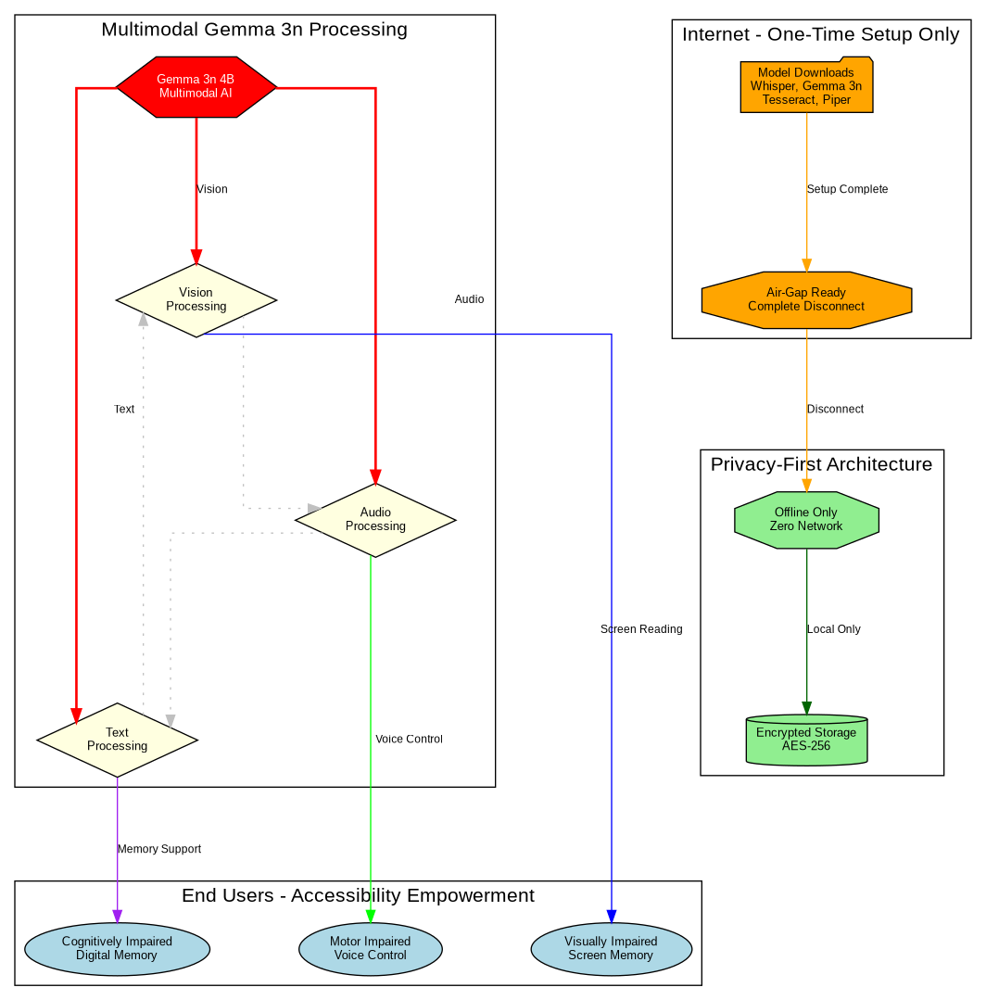
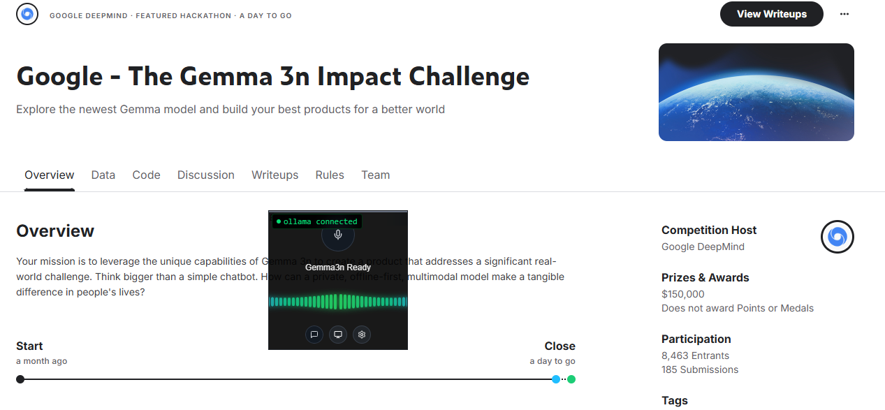
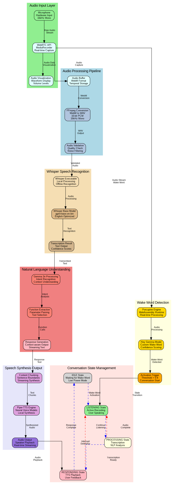
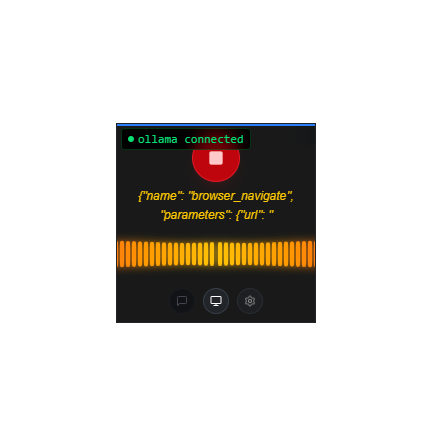
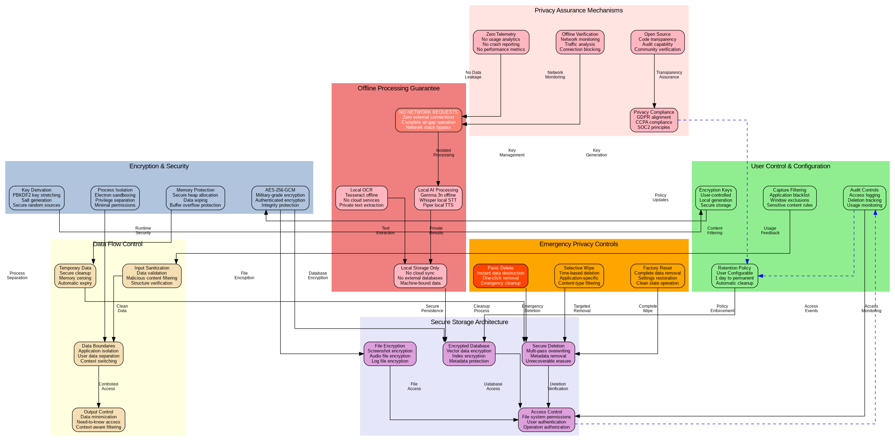
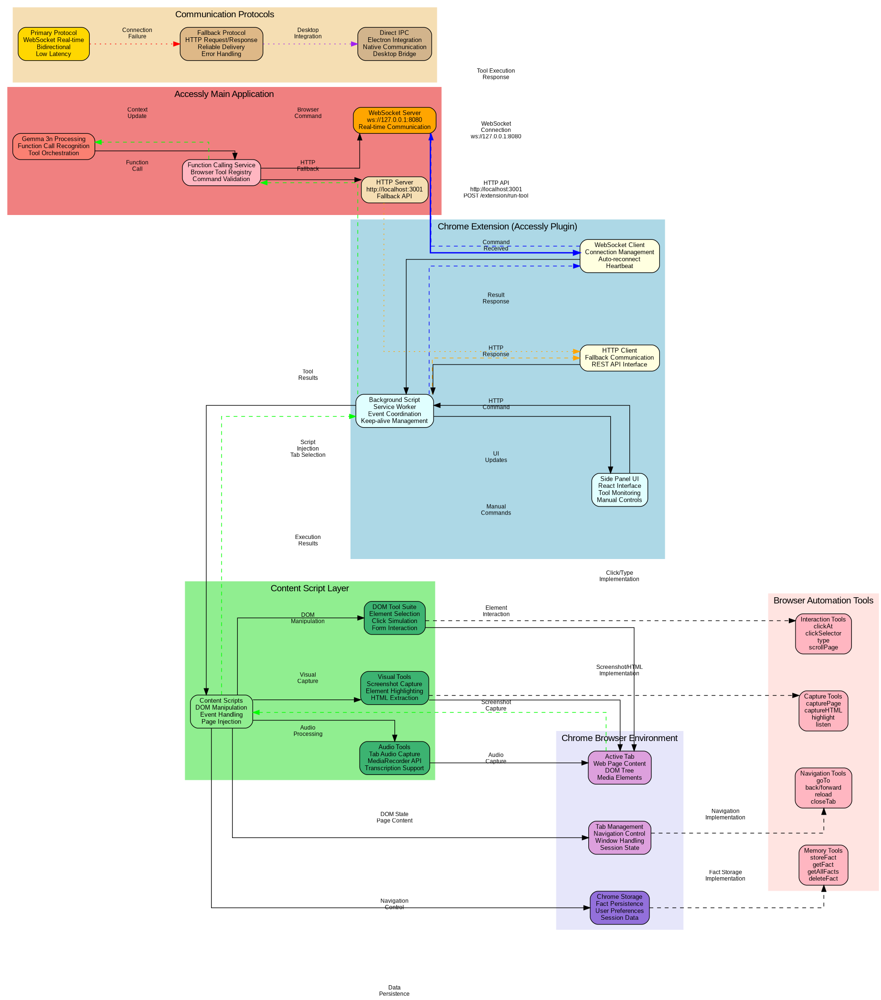
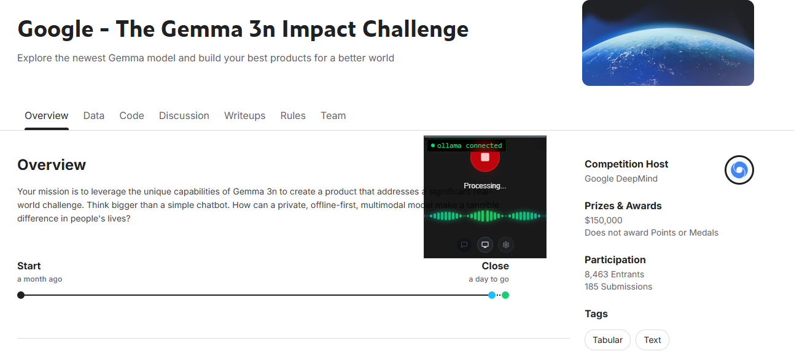

# Accessly: AI-Powered Computer Accessibility and Memory Assistant

Next-gen accessibility tools for effortless, private computer control and memory—powered by AI, designed for everyone.


## Executive Summary


Accessly transforms computer accessibility through voice-controlled AI automation, powered entirely by offline, private models. Built on Google's Gemma 3n architecture, this desktop application enables users with mobility limitations, visual impairments, or other accessibility needs to control their computers through natural conversation. The system combines wake word detection, speech recognition, intelligent task automation, and screen reading capabilities into a seamless, always-available interface that prioritizes user privacy and works without internet connectivity.

At its core, Accessly features an innovative **Screen Memory Vault** that automatically captures screen snapshots at configurable intervals, processes them through OCR, and stores vectorized embeddings locally using Gemma 3n's understanding capabilities. This creates a searchable, private archive of everything the user has seen or worked on, enabling powerful queries like "Find that document about accessibility I was reading last week" or "Show me the email thread with the client requirements." Critically, no network requests are ever made - all processing, storage, and retrieval happens entirely on the user's machine, ensuring complete privacy and offline functionality.

The application operates across both desktop environments and web browsers through an optional Chrome extension integration ([Accessly Plugin](https://github.com/youneslaaroussi/accessly-plugin)) that significantly amplifies its capabilities. While the core desktop functionality provides comprehensive OS-level automation, the browser plugin unlocks precise web interactions including DOM element extraction, CSS selector-based clicking, real-time audio capture from web pages, intelligent tab management, page reloading, and visual element highlighting for enhanced user feedback. This dual-layer approach ensures users can seamlessly transition between desktop applications and sophisticated web-based tasks using the same natural language interface.

Unlike traditional accessibility tools that require complex keyboard shortcuts or precise voice commands, Accessly understands natural language requests and can perform complex multi-step tasks autonomously. Users can compose emails, navigate websites, control applications, and search their interaction history simply by speaking to their computer after saying "Hey Gemma."

## ⚡ The Three Pillars of Accessly


<div align="center">

| 🛡️ **PRIVACY** | 🔒 **OFFLINE** | 🚀 **SPEED** |
|:---------------:|:--------------:|:------------:|
| **No data transmission**<br/>Local-only processing<br/>Military-grade encryption | **Zero internet** dependency<br/>Fully offline AI models<br/>Works anywhere, anytime | **Sub-3 second** response times<br/>Local Gemma 3n processing<br/>Optimized wake word detection |
| *Your data never leaves your machine, ever* | *Complete independence from network connectivity* | *Lightning-fast accessibility that keeps up with your thoughts* |

</div>

---

## Research-Backed Accessibility Impact



Accessly directly addresses documented accessibility barriers identified in peer-reviewed research. Studies consistently show that traditional accessibility tools create significant friction for users with disabilities:

**Performance Gaps in Traditional Tools:**
- Screen reader users take "between three and five times longer to complete" basic web tasks compared to sighted users (Craven, 2003) [1]
- Users "spend minutes traversing irrelevant elements before reaching desired information compared to vision users who visually skim in seconds" (Mohanbabu et al., 2025) [2]
- Traditional interfaces force users into "very linear" navigation where "everything for me with [the screen reader] is very linear" (Nielsen Norman Group, 2023) [3]

**User Frustration with Current Solutions:**
Research reveals deep dissatisfaction with existing accessibility technology. When asked to choose an app he loved because it was easy to use, one fully blind participant responded: "That's a hard statement because I don't love any app" - explaining that "all apps are challenging to use with a screen reader and take a long time to figure out" (Nielsen Norman Group, 2023) [3].

**Proven LLM Accessibility Benefits:**
Recent research demonstrates that AI-powered accessibility tools can dramatically reduce these gaps. Mohanbabu et al. (2025) showed that LLM-based systems reduced "the completion time gap between [vision users and screen reader users] from 2x to 1.2x" with 11 of 12 participants reporting the system "supported completing tasks with less effort and fewer distractions" [2].

**Accessly's Evidence-Based Solutions:**
- **Screen Memory Vault** addresses the documented lack of "visual memory for revisiting information" in traditional screen readers
- **Natural language commands** eliminate the need for "methodically swiping forward and backward to navigate" through sequential interfaces
- **Computer vision integration** solves the research-identified problem that "screen-reader users have little or no visual context for a link" (Nielsen Norman Group, 2023) [3]

## Prerequisites

Accessly requires a Windows x64 machine with several offline AI components to ensure complete privacy and functionality without internet dependency.

| Component | Version | Purpose | Download Link |
|-----------|---------|---------|---------------|
| **Ollama** | Latest | Local Gemma 3n model runtime | [ollama.com](https://ollama.com/download) |
| **Python** | 3.8+ | Whisper speech recognition backend | [python.org](https://www.python.org/downloads/) |
| **Node.js** | 18+ | Application runtime and package management | [nodejs.org](https://nodejs.org/download/) |
| **pnpm** | 8+ | Fast, disk space efficient package manager | [pnpm.io](https://pnpm.io/installation) |

### Critical Setup Steps

**1. Ollama Installation & Model Setup**
```bash
# Install Ollama from the official website
# Then pull the Gemma 3n model (required for core functionality)
ollama pull gemma3n:e4b

# Verify installation
ollama list
```

**2. Whisper Dependencies**
The application includes pre-compiled Whisper binaries for Windows x64, but Python is required for audio processing pipelines.

**3. System Requirements**
- **RAM**: Minimum 8GB (16GB recommended for optimal Gemma 3n performance)
- **Storage**: 10GB free space for models and temporary audio files
- **Architecture**: Windows x64 only (due to included native binaries)

## Installation

**Clone and Install Dependencies**
```bash
git clone https://github.com/your-repo/accessly
cd accessly
pnpm install
```

**Development Mode**
```bash
pnpm dev
```

**Production Build**
```bash
pnpm build
pnpm start
```

**Optional: Chrome Plugin Enhancement**
For advanced web automation capabilities, install the companion Chrome extension:
```bash
# See detailed instructions at:
# https://github.com/youneslaaroussi/accessly-plugin
```

## Core Features & Capabilities



Accessly leverages Gemma 3n's multimodal understanding to provide comprehensive accessibility automation through natural conversation. The system combines voice interaction, computer vision, and intelligent task orchestration to eliminate traditional accessibility barriers.

### Use Case Overview

| 🎯 Primary Use Case | 🔧 Technology | 💬 Example Command | 🌟 Accessibility Impact |
|---------------------|---------------|-------------------|-------------------------|
| 📧 **Email Management** | Browser automation + NLP | "Send a follow-up email to the client about the project" | Eliminates complex keyboard navigation for mobility-impaired users |
| 🔍 **Information Retrieval** | Screen Memory Vault + Vector search | "Find that accessibility report I was reading last Tuesday" | Provides perfect recall for users with cognitive limitations |
| 📝 **Document Navigation** | OCR + Computer vision | "Read the main points from this PDF and summarize them" | Full document access for visually impaired users |
| 🌐 **Web Automation** | Chrome plugin + DOM manipulation | "Fill out this contact form with my standard information" | Reduces repetitive tasks for users with motor difficulties |
| 📊 **Research & Analysis** | Multi-tab coordination + content extraction | "Compare pricing on these three websites and create a summary" | Streamlines complex research tasks requiring multiple sources |
| 🎵 **Media Processing** | Audio capture + transcription | "What are the key points being discussed in this video?" | Makes audio/video content accessible to hearing-impaired users |
| 🏠 **System Control** | OS integration + voice commands | "Open my calendar and schedule a meeting for tomorrow at 2 PM" | Hands-free computer control for users with mobility restrictions |
| 🧠 **Memory Assistance** | Temporal indexing + visual context | "Show me what I was working on when I got interrupted yesterday" | Cognitive support for task resumption and context switching |

### Voice-First Interaction Model



| Feature | Implementation | Accessibility Benefit |
|---------|----------------|----------------------|
| **Wake Word Detection** | "Hey Gemma" activation using Porcupine engine | Hands-free initiation for users with mobility limitations |
| **Continuous Listening** | Real-time audio processing with visual feedback | Clear system state indication for hearing-impaired users |
| **Natural Language Processing** | Gemma 3n conversational understanding | No need to memorize specific commands or syntax |
| **Speech Synthesis** | Piper TTS with customizable voices | Audio feedback for visually impaired users |

*Audio waveform visualization during voice interaction showing listening and response states*

### Intelligent Task Automation

Gemma 3n's function calling capabilities enable sophisticated multi-step workflows through simple voice commands. The system can orchestrate complex sequences of actions across both desktop and web environments.

#### Desktop Automation Capabilities

| Category | Tools Available | Example Use Cases |
|----------|----------------|-------------------|
| **System Control** | Time queries, application launching | "What time is it?" → "Open my calendar" |
| **Screen Reading** | OCR text extraction, visual analysis | "Read what's on my screen" → Full page narration |
| **Memory & Search** | Screen Memory Vault with vectorized embeddings | "Find that document about accessibility I was reading last week" |
| **Computer Vision** | Screenshot analysis, element detection | "Click the blue submit button" |

#### Web Automation Capabilities (via Chrome Plugin)

| Category | Tools Available | Example Use Cases |
|----------|----------------|-------------------|
| **Navigation** | URL navigation, tab management, page reloading | "Open Gmail in a new tab" |
| **DOM Interaction** | Element clicking, form filling, scrolling | "Fill out this contact form with my details" |
| **Content Analysis** | HTML extraction, visual highlighting | "Summarize the main points on this page" |
| **Audio Processing** | Tab audio capture, transcription | "What's being said in this video?" |

*Screenshot showing DOM element highlighting and interaction feedback in Chrome*

### Agentic Workflow Examples

#### Email Composition Workflow
```
User: "Send an email to john@company.com about the project deadline"

Gemma 3n Agent Execution:
1. browser_navigate → "https://gmail.com"
2. find_and_click_text → "Compose"
3. find_and_click_text → "To" field
4. type_text → "john@company.com"
5. find_and_click_text → "Subject" field
6. type_text → "Project Deadline Update"
7. press_tab → Move to email body
8. type_text → [AI-generated professional email content]
9. find_and_click_text → "Send"
10. Confirmation: "Email sent successfully to John"
```

*Step-by-step visual workflow showing Gmail automation from compose to send*

#### Screen Memory Vault Query Workflow
```
User: "Find that PDF about WCAG compliance I was reviewing yesterday"

Gemma 3n Agent Execution:
1. search_memory → Query vectorized screen embeddings for "WCAG compliance PDF"
2. Retrieve matching screen snapshots with OCR text analysis
3. Present temporal results: "Found 3 matches from yesterday 2-4 PM"
4. Display thumbnail previews with extracted text snippets
5. User: "Open the second one"
6. Locate file path from snapshot metadata
7. Launch PDF viewer with exact document
8. Confirmation: "Opened WCAG_2.1_Guidelines_Final.pdf from Downloads folder"

Privacy Note: All processing occurs locally - no data ever leaves the machine
```

#### Research & Documentation Workflow
```
User: "Research the latest accessibility guidelines and create a summary"

Gemma 3n Agent Execution:
1. search_memory → "accessibility guidelines" (find previous vault research)
2. Present cached results: "Found related content from last month's research"
3. browser_navigate → "https://www.w3.org/WAI/WCAG21/quickref/"
4. read_screen_text → Extract current page content
5. browser_navigate → "https://webaim.org"
6. capturePage → Screenshot for visual analysis + vault storage
7. Generate comprehensive summary combining vault history + new sources
8. Auto-store current session in vault for future reference
```

#### Accessibility Testing Workflow
```
User: "Check if this website meets accessibility standards"

Gemma 3n Agent Execution:
1. capturePage → Full page screenshot analysis
2. captureHTML → DOM structure examination
3. highlight → Visual indicators for accessibility issues
4. read_screen_text → Text content analysis
5. Generate detailed accessibility report:
   - Color contrast ratios
   - Alt text coverage
   - Keyboard navigation paths
   - ARIA label compliance
6. Provide actionable recommendations
```

### Memory & Context Management

Accessly maintains persistent context across sessions through an integrated vector database, enabling personalized assistance that improves over time.

| Memory Type | Storage Method | Use Cases |
|-------------|----------------|-----------|
| **Screen Memory Vault** | Automated snapshots + vectorized OCR embeddings | "Find that PDF I was reviewing yesterday at 3 PM" |
| **Conversation History** | Vector embeddings with Gemma 3n understanding | "Continue our discussion from yesterday about WCAG" |
| **User Preferences** | Local encrypted storage | Remembered form data, frequent actions |
| **Task Templates** | Structured workflow storage | "Do my morning email routine" |
| **Visual Context** | Screenshot analysis + temporal indexing | "Show me what I was working on before lunch" |

### Real-Time Feedback Systems



#### Visual Indicators
- **Waveform Animation**: Real-time audio visualization during voice interaction
- **Status Messages**: Clear system state communication ("Listening...", "Processing...", "Executing...")
- **Element Highlighting**: Visual feedback when interacting with web elements
- **Progress Indicators**: Multi-step task completion status

#### Audio Feedback
- **Confirmation Sounds**: Success/error audio cues for non-visual users
- **Speech Synthesis**: Detailed narration of actions and results
- **Interrupt Capability**: Voice-activated halt during long operations

## Technical Architecture

Accessly's architecture demonstrates advanced integration of Gemma 3n's multimodal capabilities with offline-first design principles. The system operates through multiple interconnected layers that ensure complete privacy while delivering sophisticated AI-powered accessibility features.

### System Architecture Overview

*High-level system architecture diagram showing Electron main process, renderer process, Ollama runtime, and Chrome extension communication flows*

The application follows a multi-process architecture built on Electron, with clear separation between the main process (Node.js backend services), renderer process (React UI), and external integrations (Ollama, Chrome extension). All AI processing occurs locally through Ollama's Gemma 3n runtime, ensuring zero network dependencies for core functionality.

| Component Layer | Technology Stack | Primary Responsibility |
|-----------------|------------------|----------------------|
| **Frontend UI** | React 19, TypeScript, Framer Motion | Voice interaction interface and real-time feedback |
| **Main Process** | Electron, Node.js, IPC Communication | Service orchestration and system integration |
| **AI Runtime** | Ollama, Gemma 3n 4B model (gemma3n:e4b) | Natural language processing and function calling |
| **Speech Processing** | Whisper (local), Piper TTS, Porcupine wake word | Offline speech-to-text and text-to-speech |
| **System Control** | nut.js, Native OS APIs (PowerShell, AppleScript, xdotool) | Cross-platform desktop automation and interaction |
| **Browser Integration** | Chrome Extension, WebSocket/HTTP APIs | Web automation and DOM manipulation |
| **Storage Layer** | Vectra vector database, SQLite, Chrome Storage | Embeddings, snapshots, and user preferences |

### Gemma 3n Integration Architecture

*Detailed diagram showing Gemma 3n model interaction flow from user input through function calling to system execution*

Accessly leverages Gemma 3n's unique architectural features to provide responsive, context-aware assistance:

#### Gemma 3n Model Configuration
Accessly uses the Gemma 3n 4B model (`gemma3n:e4b`) consistently for all operations, providing optimal balance between performance and capability:

```
All Operations → Gemma 3n 4B model (gemma3n:e4b)
- Natural language understanding
- Function calling and parameter extraction  
- Multi-step workflow orchestration
- Vector embedding generation
- Response synthesis
```

#### Function Calling Pipeline
```
1. User Speech Input → Whisper Transcription
2. Gemma 3n Natural Language Understanding
3. Function Parameter Extraction
4. Tool Selection & Validation
5. Sequential Function Execution
6. Result Processing & Response Generation
7. Piper TTS Audio Feedback
```

*Sequence diagram showing function calling flow from speech input to system action execution*

### Screen Memory Vault Architecture

The Screen Memory Vault represents Accessly's most innovative feature, providing comprehensive visual memory through automated screenshot analysis and vectorized storage.

#### Automated Capture System
```
Screen Capture Service (configurable intervals: 1-10 minutes)
    ↓
Screenshot Processing (PNG compression + metadata)
    ↓
OCR Text Extraction (Tesseract.js engine)
    ↓
Content Preprocessing (text cleaning + structure analysis)
    ↓
Gemma 3n Embedding Generation (local vector creation)
    ↓
Vector Database Storage (Vectra with temporal indexing)
```

#### Privacy-First Design



All processing occurs entirely offline with multiple privacy safeguards:

| Privacy Layer | Implementation | Benefit |
|---------------|----------------|---------|
| **Local Processing** | No network requests during capture/analysis | Zero data leakage risk |
| **Encrypted Storage** | AES-256 encryption for sensitive snapshots | Protection against local access |
| **Configurable Retention** | User-defined storage duration limits | Control over data persistence |
| **Selective Capture** | Application/window filtering options | Exclude sensitive applications |
| **Instant Deletion** | Real-time vault clearing capabilities | Emergency privacy protection |

#### Temporal Indexing System

The vault maintains rich temporal context enabling sophisticated queries:

```sql
-- Example query structure for "Find document I was reading yesterday afternoon"
SELECT snapshots.*, embeddings.similarity_score 
FROM snapshots 
JOIN embeddings ON snapshots.id = embeddings.snapshot_id
WHERE timestamp BETWEEN '2024-01-15 12:00:00' AND '2024-01-15 18:00:00'
  AND vector_similarity(query_embedding, content_embedding) > 0.8
ORDER BY similarity_score DESC, timestamp DESC
```

### Speech Processing Pipeline

*Audio processing flow diagram from microphone input through Whisper to Gemma 3n and back to Piper TTS*

#### Wake Word Detection
Accessly uses Porcupine's "Hey Gemma" wake word model for hands-free activation:

```
Microphone Audio Stream (16kHz, mono)
    ↓
Porcupine Real-time Processing (WebAssembly)
    ↓
Wake Word Confidence Scoring
    ↓
Activation Trigger (>0.8 confidence)
    ↓
Conversation State Transition
```

#### Speech Recognition Architecture
```
Audio Buffer Capture (WebRTC MediaRecorder)
    ↓
WebM to WAV Conversion (FFmpeg)
    ↓
Whisper Model Processing (local executable)
    ↓
Transcription Result with Confidence Scores
    ↓
Gemma 3n Natural Language Understanding
```

#### Text-to-Speech Pipeline
```
Gemma 3n Response Generation
    ↓
Content Chunking (sentence boundaries)
    ↓
Piper TTS Processing (local neural voices)
    ↓
Audio Stream Generation
    ↓
Real-time Playback with Visual Feedback
```

### Chrome Extension Integration



The optional Chrome extension significantly extends Accessly's capabilities through sophisticated browser automation:

#### Multi-Protocol Communication
```
Primary: WebSocket (ws://localhost:8080)
    ↓ (if failed)
Fallback: HTTP REST API (http://localhost:3001)
    ↓ (if failed)  
Electron IPC (direct desktop integration)
```

#### Tool Execution Architecture



```
1. Gemma 3n Function Call Recognition
2. WebSocket Command Transmission
3. Chrome Extension Background Script Processing
4. Content Script Injection (target tab)
5. DOM Manipulation Execution
6. Result Capture & Encoding
7. Response Transmission Back to Gemma 3n
8. User Feedback Generation
```

#### Advanced Browser Capabilities
| Tool Category | Implementation Detail | Technical Approach |
|---------------|----------------------|-------------------|
| **Visual Capture** | Full page screenshots with base64 encoding | HTML2Canvas + Chrome Capture API |
| **DOM Analysis** | Complete HTML structure extraction | TreeWalker API + sanitization |
| **Audio Processing** | Tab audio capture for transcription | MediaRecorder + WebRTC |
| **Element Interaction** | Precise clicking with visual feedback | CSS selector resolution + highlighting |
| **Memory Integration** | Persistent fact storage across sessions | Chrome Storage API + encryption |

### Vector Database Implementation

Accessly uses Vectra for local vector storage with Gemma 3n-generated embeddings:

#### Embedding Strategy
```
Text Content → Gemma 3n Embedding Model → 768-dimensional vectors
Visual Content → OCR Extraction → Text Embedding → Vector Storage
User Queries → Real-time Embedding → Similarity Search → Ranked Results
```

#### Storage Optimization
| Optimization Technique | Implementation | Performance Benefit |
|----------------------|----------------|-------------------|
| **Hierarchical Indexing** | Time-based partitioning | Faster temporal queries |
| **Compression** | Vector quantization | Reduced storage footprint |
| **Caching** | LRU cache for frequent queries | Sub-second search response |
| **Batch Processing** | Bulk embedding generation | Improved throughput |

### Performance Optimization

#### Resource Management
```
Memory Usage Monitoring
    ↓
Gemma 3n 4B Model Optimization (consistent model usage)
    ↓
Garbage Collection Optimization
    ↓
Background Process Throttling
```

#### Response Time Optimization
| Component | Target Latency | Optimization Strategy |
|-----------|----------------|----------------------|
| **Wake Word Detection** | <100ms | Hardware-accelerated processing |
| **Speech Recognition** | <2s | Local Whisper with GPU acceleration |
| **Gemma 3n Inference** | <3s | Model caching + warm startup |
| **Function Execution** | <1s | Parallel tool execution |
| **Vector Search** | <500ms | Indexed similarity search |

### Security & Privacy Architecture

#### Zero-Trust Privacy Model
```
No Network Requests → No Data Transmission → No Privacy Breach
Local Processing Only → Encrypted Local Storage → User-Controlled Retention
```

#### Security Implementations
| Security Layer | Technology | Protection Level |
|----------------|------------|------------------|
| **Data Encryption** | AES-256-GCM | Military-grade local storage |
| **Process Isolation** | Electron security model | Sandboxed execution |
| **Memory Protection** | Secure heap allocation | Runtime data protection |
| **Access Control** | File system permissions | Restricted resource access |

### Hardware Requirements & Performance

Accessly demonstrates that powerful AI accessibility tools can run efficiently on consumer hardware, making advanced assistance available to users regardless of their technical or financial resources.

#### Development & Testing Hardware
```
Primary Development Machine: Standard Consumer Laptop
- CPU: Intel/AMD x64 processor (mid-range)
- RAM: 16GB (8GB minimum supported)
- Storage: 512GB SSD (10GB required for models/data)
- OS: Windows 10/11 x64
- Network: Not required for core functionality
```

#### Resource Efficiency Metrics
| Operation Mode | CPU Usage | RAM Usage | Disk I/O | Response Time |
|----------------|-----------|-----------|----------|---------------|
| **Idle (Wake Word)** | <5% | 200MB | Minimal | <100ms detection |
| **Active Listening** | 15-25% | 400MB | Low | <2s transcription |
| **Gemma 3n Inference** | 40-70% | 800MB-1.2GB | Medium | <3s response |
| **Screen Vault Processing** | 20-30% | 300MB | High (burst) | Background |
| **Browser Automation** | 10-20% | 200MB | Low | <1s execution |


This efficiency ensures that users with older or budget hardware can still access sophisticated AI assistance, democratizing advanced accessibility technology.


## Performance Benchmarking

### Ollama Gemma 3n Performance Testing

The `benchmark_ollama_performance.js` script provides comprehensive performance testing for the Ollama Gemma 3n model used in Accessly.

#### Prerequisites
- Node.js 18+
- Running Ollama instance with gemma3n:e4b model
- Ollama npm package (already included in project dependencies)

#### Usage

**Basic benchmark:**
```bash
cd scripts
node benchmark_ollama_performance.js
```

**Advanced options:**
```bash
# Run with custom iterations and verbose output
node benchmark_ollama_performance.js --iterations 20 --verbose

# Test different model or host
node benchmark_ollama_performance.js --model gemma3n:2b --host http://localhost:11434

# Save detailed results to file
node benchmark_ollama_performance.js --output benchmark_results.json

# Show help
node benchmark_ollama_performance.js --help
```

#### Test Categories

| Test Type | Purpose | Metrics |
|-----------|---------|---------|
| **Connection** | Ollama server connectivity | Latency, success rate |
| **Simple Queries** | Basic conversational responses | Response time, tokens/sec |
| **Medium Queries** | Accessibility-focused questions | Response time, tokens/sec |
| **Complex Queries** | Multi-step reasoning tasks | Response time, tokens/sec |
| **Streaming** | Real-time response generation | First token latency, throughput |
| **Concurrent** | Multiple simultaneous requests | Total time, average latency |

#### Performance Targets

For optimal Accessly user experience:
- **Simple queries**: < 3 seconds
- **Complex queries**: < 5 seconds  
- **First token latency**: < 1 second
- **Token generation**: > 10 tokens/second
- **Connection latency**: < 100ms

#### Output

The script provides:
1. **Real-time progress** during testing
2. **Performance report** with recommendations
3. **JSON export** of detailed results (optional)
4. **Status indicators** (Excellent/Good/Needs Improvement)

Example output:
```
📊 Performance Report
{
  "performance": {
    "simple": {
      "averageLatency": "2.45s",
      "tokensPerSecond": "15.3",
      "status": "Excellent"
    },
    "streaming": {
      "firstTokenLatency": "850ms", 
      "tokensPerSecond": "18.7",
      "status": "Excellent"
    }
  },
  "recommendations": [
    "Performance is optimal for accessibility use cases"
  ]
}
```

### Privacy Architecture: Zero-Trust Model

**Privacy is not a feature - it's the foundation.** For users with disabilities, maintaining control over personal data is critical, as accessibility tools often process the most sensitive aspects of daily life.

#### Absolute Privacy Guarantees
```
NO NETWORK REQUESTS ≡ NO DATA LEAKAGE
    ↓
NO CLOUD PROCESSING ≡ NO THIRD-PARTY ACCESS  
    ↓
NO DATA TRANSMISSION ≡ NO SURVEILLANCE RISK
    ↓
LOCAL ENCRYPTION ≡ NO UNAUTHORIZED ACCESS
```

#### Privacy Impact for Accessibility Users

| User Need | Privacy Risk (Traditional Tools) | Accessly Protection |
|-----------|----------------------------------|-------------------|
| **Screen Reading** | Screenshots sent to cloud OCR services | Local Tesseract processing, encrypted storage |
| **Voice Commands** | Audio transmitted to speech recognition APIs | Local Whisper processing, no audio leaves device |
| **Personal Information** | Forms, emails, documents processed remotely | All text analysis via local Gemma 3n model |
| **Medical Information** | Health data exposed through cloud processing | Medical terminology processed locally |
| **Financial Data** | Banking/payment info vulnerable in cloud | Financial automation occurs entirely offline |
| **Private Communications** | Messages/emails analyzed by external services | Communication assistance through local AI only |

#### User Control & Transparency
```
Data Retention: User-configurable (1 day to permanent)
    ↓
Selective Capture: Application-specific filtering
    ↓  
Instant Deletion: Emergency privacy clearing
    ↓
Audit Trail: Complete local activity logging
    ↓
No Hidden Processes: Open source verification
```

### Accessibility Impact: Breaking Down Barriers

**Technology must serve those who need it most.** Accessly specifically addresses the gaps that leave millions of users struggling with inadequate accessibility solutions.

#### Motor Accessibility Revolution

**Traditional Challenges:**
- Complex keyboard shortcuts requiring precise finger coordination
- Mouse movements demanding fine motor control
- Multi-step processes requiring sustained physical effort
- Fatigue from repetitive accessibility workflows

**Accessly Solutions:**
```
"Send an email to my doctor about my appointment" 
→ Replaces 15+ keyboard/mouse actions with single voice command

"Find that insurance document I was reviewing yesterday"
→ Eliminates file browsing requiring precise clicking

"Fill out this medical form with my standard information"  
→ Automates tedious data entry across web forms
```

#### Visual Accessibility Transformation

**Traditional Limitations:**
- Screen readers provide text-only navigation
- No understanding of visual context or layout
- Complex web pages become incomprehensible
- No visual memory for revisiting information

**Accessly Enhancements:**
```
Screen Memory Vault: "Show me that chart about medication side effects"
→ Visual information made accessible through AI description

Intelligent Navigation: "Click the blue submit button next to the payment section"  
→ Computer vision eliminates screen reader linearization

Contextual Understanding: "Summarize the main points from this PDF"
→ Document comprehension beyond simple text reading
```

#### Cognitive Accessibility Support

**Cognitive Challenges Addressed:**
- Working memory limitations affecting task completion
- Difficulty remembering complex interaction sequences  
- Confusion with abstract interface elements
- Anxiety from fear of making mistakes

**Assistive Capabilities:**
```
Task Memory: "Continue what I was working on before I got interrupted"
→ Perfect recall eliminates cognitive burden

Process Guidance: "Help me send an email" → Step-by-step automation
→ Removes complexity from multi-step tasks

Error Prevention: AI validates actions before execution
→ Reduces anxiety about making mistakes

Natural Language: Plain English commands replace technical interfaces
→ Eliminates need to learn accessibility-specific syntax
```

#### Hearing Accessibility Integration

**Hearing Accessibility Features:**
- Real-time visual feedback for all audio interactions
- Vibrant waveform visualization showing system state
- Text-based alternatives for all audio notifications
- Visual progress indicators for long-running tasks

```
Audio → Visual Translation: All system audio converted to visual cues
Screen Reader Integration: Enhanced compatibility with existing AT
Alert Systems: Visual notification system for hearing-impaired users
```

### Real-World Accessibility Impact

#### Daily Workflow Transformation

Research demonstrates the transformative potential when accessibility barriers are removed through AI automation. By eliminating the sequential navigation requirements and providing natural language control, Accessly addresses the fundamental inefficiencies documented in academic studies.

This technical architecture demonstrates how Accessly achieves sophisticated AI-powered accessibility through entirely offline processing, positioning it perfectly for the Gemma 3n Impact Challenge's emphasis on private, on-device AI capabilities that create meaningful real-world impact.

## Citations & References

[1] Craven, J. (2003). Access to electronic resources by visually impaired people. *Information Research*, 8(4). Retrieved from https://informationr.net/ir/8-4/paper156.html

[2] Mohanbabu, A. G., Sechayk, Y., & Pavel, A. (2025). Task Mode: Dynamic Filtering for Task-Specific Web Navigation using LLMs. *arXiv preprint arXiv:2507.14769*. Retrieved from https://arxiv.org/abs/2507.14769

[3] Kohler, T. (2023, April 30). Challenges for Screen-Reader Users on Mobile. *Nielsen Norman Group*. Retrieved from https://www.nngroup.com/articles/screen-reader-users-on-mobile/

## Future Enhancements

- Halt scream command "Stop Gemma" using 